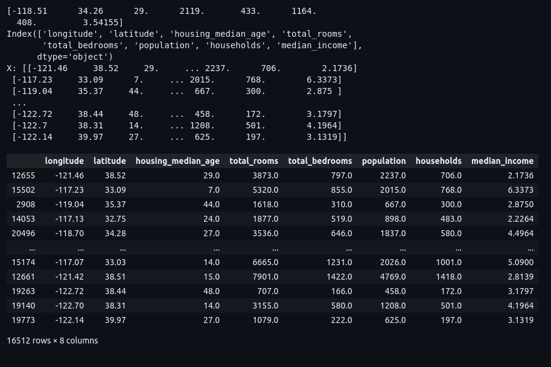

<h1> Housing Dataset - Linear Regression ML Python Project</h1>
 
<h2>Features</h2>
<li>Import CSV file with code</li>
<li>Creating histogram</li>
<li>Module for Artificial Intelligence (scikit-learn)</li>
<li>See how many has in every single categories and what they are</li>
<li>Import the stratified shuffle split to show how to make the division</li>
<li>See how the division is made (80% train, 20% test)</li>
<li>Calculate in procents for each category FOR TEST</li>
<li>Calculate in procents for each category FOR TRAIN</li>
<li>Calculate in procents for each category before the spliting</li>
<li>Graphic for train data set</li>
<li>Find the Pearson's correlation coefficients betweeen every pair of attributes longitude == latitude and etc</li>
<li>Print the Pearson's coefficient between each attribute and each attribute and the median house value</li>
<li>Matrix with multiple plots with scatter points</li>
<li>Print the most correlated atributes (median_house_value vs. median_income)</li>
<li>Learn and calculate the median on each meadian coloumn(fit method)</li>
<li>Replaces NA values with median</li>
<li>One hot encoding procedure</li>
<li>Pipeline</li>
<li>Create an object with the class pipeline (list of tuples)</li>
<li>Train (fit to find the median) and modify the values with median the list of tuples</li>
<li>Transforming numerical and categorical columns in a single pipeline</li>
<li>TRAINING MODELS</li>
<li>METHOD 1- SIMPLE TRAINING(the worse method)</li>
<li>Calculate the error RMSE (Root Mean Squared Error)</li>
<li>Using a more powerful model for better results - DecissionTreeRegressor</li>
<li>METHOD 2 - cross validation (a little bit better method)</li>
<li>Define a function to display errors and calculate the mean of the erros and the std. deviation</li>
<li>Compute cross validation for linear regression</li>
<li>METHOD 3 - RANDOM FOREST REGRESSOR THE BEST METHOD</li>
<li>Calculate the error without cross validation</li>
<li>Calculate error with cross validation BEST SOLUTION</li>
<li>Find the best values for hyperparameters with GridSearchCV for a small number of hyperparameters / RandomizedSearchCV for a large number of hyperparameters</li>
<li>Notice: If you have no idea of hyperparameter, try consecutive power of 10, or smaller values</li>
<li>Making 90 rounds of training {3 x 4} + {2 x 3} x 5</li>
<li>Trick: n_jobs to put all the 8 cores to join the training (more fast)</li>
<li>Create the grid search object</li>
<li>Print the best estimators and params</li>

<h2>Acknowledgments</h2>

<b> Python3: http://bit.ly/python3-certifications <b>
 
<b> Machine Learning: https://bit.ly/machine-learning-certification <b>

<h2>Dataset CSV</h2>
<b> Link: http://isb.pub.ro/docs/housing.tgz<b>
 

<h2>Photo</h2>

 

<h2>Contact</h2>

<b> Email: mariusc0023@gmail.com </b>
